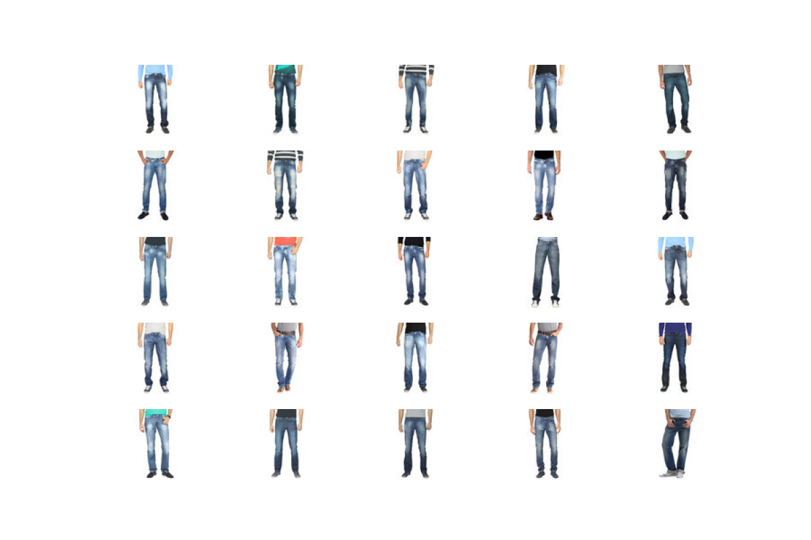

## Image semantic search

This project uses a fashion dataset available on `huggingface` ans `sentence_transformers` library to create a basic image semantic search.

  
  <h6 align="center">
    A query example (query: "blue jeans for men")
  </h6>

## Requirements

- Python 3.10 or later
- Click
- Sentence Transformers